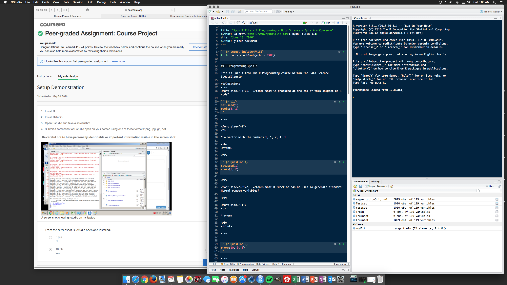

```{r setup, include=FALSE}
knitr::opts_chunk$set(echo = TRUE)
```

## Setup

Showing R and github are properly configured.

Rstudio Setup


Github Repo
<https://github.com/ryantillis/Toolbox>

Quiz 1 Markdown
<https://github.com/ryantillis/Toolbox/blob/master/Quizzes/quiz1.md>

Forked Repo
<https://github.com/ryantillis/Microsoft-TDSP>